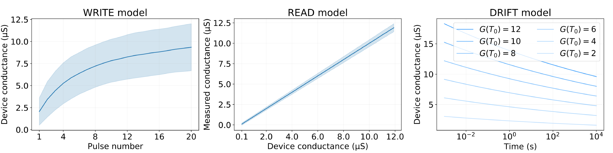

## Meta-Learning on Analog Crossbar Arrays for Adaptation on the Edge

meta-analog is a JAX implementation of the Model-Agnostic Meta-Learning ([MAML](https://arxiv.org/abs/1703.03400)) for spiking neural networks 
realized on a differentiable analog hardware model. Sounds too fancy? Here is why it is essential:

- **Why analog hardware?** Analog hardware, e.g., PCM crossbar arrays, can implement $O(1)$ matmul operation using Kirchhoff's Current Law and Ohm's Law. This leads to extremely low energy (no von Neumann bottleneck since there is no data movement). These devices are currently the most scalable solutions for edge inference.

- **Why spikes?** Purely as an engineering requirement. The spikes are the most robust way to encode information on noisy substrates like analog crossbar arrays (or brain). Spikes are also the language of event-based sensors.

- **Why meta-learning?** Meta-learning is a silver bullet to edge adaptation as it solves multiple significant issues related to analog hardware and spiking networks.

 1) The memristive devices have limited bit-resolution of ~2-3 bits. This leads to a considerable performance drop if we want to train on the edge. However, meta-learned inner loop updates have 100-1000x larger magnitudes than usual training scenarios.

 2) Efficient credit assignment in multilayer spiking networks is an unsolved problem. Meta-learning allows updating only the network's last layer for the new task, which can be implemented by simple [Delta Rule](https://en.wikipedia.org/wiki/Delta_rule).

 3) Training from tabula-rasa is not feasible for edge devices. Because offline training with larger datasets offers finds better solutions. And devices can be precisely programmed offline with iterative programming.

 4) For the materials like PCM, whose conductance slowly drifts with time, edge adaptation keeps the network performance stable.

### meta-analog

There are three main components of the meta-analog:

- `train.py`: Implements meta-training and meta-testing of MAML for the spiking network for sinusoidal regression task. Offline updates are performed using noise-resilient programming technique noise injection via straight-through estimator.
- `network.py`: Implements 2-layer Leaky Integrate-and-Fire (LIF) spiking neural network.
- `analog.py`: Implements differentiable PCM crossbar array model.


### PCM Crossbar Model

<center>

<i>Implemented PCM model</i><br/>
</center>
<p></p>

PCM crossbar array simulation framework is developed based on the PCM device model introduced by [_Nandakumar, S. R. et al, 2018_](https://aip.scitation.org/doi/10.1063/1.5042408). This empirical model is based on the experimental data gathered from 10,000 devices and captures the programming noise, read noise and temporal conductance drift without diluting the analog device non-idealities (cycle-to-cycle and device-to-device variability). It is straightforward to deploy models trained in this PCM model to real analog hardware, see [_our paper with IBM Research_](https://ieeexplore.ieee.org/abstract/document/9869963).

### Example Usage

- To start MAML training using PCM-based analog weight implementation:

`python train.py --n_iter 50000`

- To start MAML training in the _performance_ mode using quantized 2-bit weight updates. This mode randomly initializes the weights but every inner loop weight update is quantized to 2-bit.

`python train.py --n_iter 50000 --perf`

### Reference

This is an unpublished work. A GitHub ⭐️ is the best ~~citation~~ for now.

```
@unpublished{demirag22github,
 author = {Yigit Demirag and Regina Dittmann and Giacomo Indiveri and Emre Neftci},
 title = {Overcoming phase-change material non-idealities by meta-learning for adaptation on the edge},
 note = {Contributed talk at Online Conference on Neuromorphic Materials, Devices, Circuits and Systems (NeuMatDeCaS) [submitted]}
 url = {http://github.com/yigitdemirag/meta-analog},
 year = {2023},
}
```
